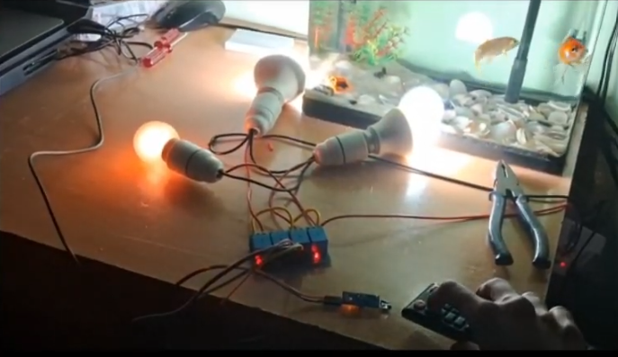
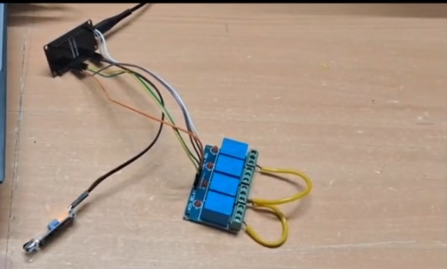
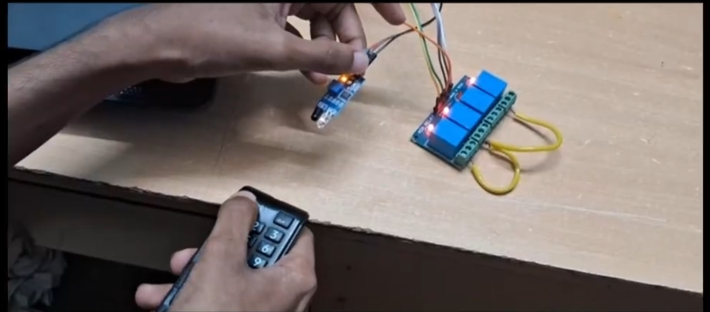
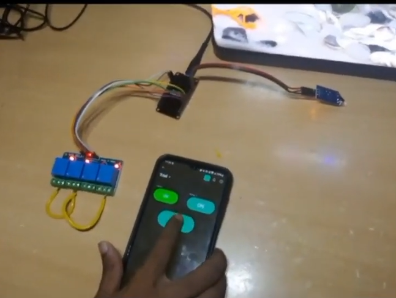
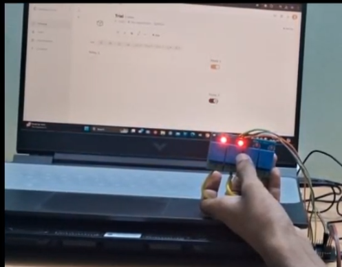

<<<<<<< HEAD
# Smart Switching using ESP32, IR Remote & Blynk IoT

<p align="center">


</p>

A dual-mode **Home Automation System** that enables users to control electrical appliances using either an **IR Remote** or the **Blynk IoT Platform**. The ESP32 acts as the central controller, providing seamless synchronization between physical hardware and cloud-based interfaces.

---

# Project Demonstration

<p align="center">

</p>

The project demonstrates:

- Local appliance control using an IR TV Remote
- Remote control through the Blynk Mobile App
- Web Dashboard monitoring and control
- Real-time synchronization between hardware and cloud

---

# Features

✔ Dual Mode Control (IR Remote + WiFi)

✔ Mobile App Control using Blynk

✔ Web Dashboard Control

✔ Real-time Device Status Synchronization

✔ Supports up to 4 Electrical Loads

✔ Easy GPIO Expansion

✔ Low-cost IoT Home Automation Solution

---

# System Architecture

```
                   IR Remote
                        │
                        ▼
                 IR Receiver Sensor
                        │
                        ▼
                  ESP32 NodeMCU
               ┌────────┴─────────┐
               │                  │
               ▼                  ▼
         4-Channel Relay      Blynk Cloud
               │                  │
               ▼                  ▼
      Electrical Appliances   Mobile App
                               Web Dashboard
```

---

# Hardware Components

| Component | Quantity |
|------------|---------:|
| ESP32 NodeMCU | 1 |
| IR Receiver Module | 1 |
| 4-Channel Relay Module | 1 |
| IR TV Remote | 1 |
| AC Light Bulbs (Demo) | 4 |
| Jumper Wires | As Required |
| Breadboard / PCB | 1 |
| 5V Power Supply | 1 |

---

# Hardware Setup

<p align="center">

</p>

The ESP32 acts as the main controller and interfaces with:

- IR Receiver Module
- 4-Channel Relay Board
- Blynk Cloud Platform
- Electrical Loads

---

# Circuit Connections

The detailed wiring diagram can be found in:

```
Circuit/
└── PinDiagram.png
```

## GPIO Mapping

| Device | ESP32 GPIO |
|----------|-----------|
| IR Receiver OUT | GPIO 15 |
| Relay 1 | GPIO 5 |
| Relay 2 | GPIO 18 |
| Relay 3 | GPIO 19 |
| Relay 4 | GPIO 21 |

Power Connections

| Device | ESP32 Pin |
|---------|-----------|
| IR Receiver VCC | 3.3V |
| Relay Module VCC | 5V |
| All Grounds | GND |

---

# Software Stack

- Arduino IDE
- ESP32 Board Package
- Blynk IoT Platform
- IRremote Library
- WiFi Library

---

# Working Principle

The ESP32 continuously listens for IR signals from the receiver.

When a valid button press is detected:

- The corresponding relay changes state.
- The appliance is switched ON/OFF.
- The ESP32 immediately updates the Blynk Cloud.
- The Mobile App and Web Dashboard automatically reflect the new state.

Similarly, if a command is received from the Blynk App:

- ESP32 updates the relay state.
- Hardware changes immediately.
- All interfaces remain synchronized.

---

# IR Remote Control

<p align="center">

</p>

The IR receiver decodes hexadecimal button codes transmitted from a standard TV remote.

Example mapping:

| Remote Button | Action |
|--------------|--------|
| Button 1 | Toggle Relay 1 |
| Button 2 | Turn OFF All Relays |
| Button 3 | Toggle Relay 3 |
| Button 4 | Toggle Relay 4 |

The mapping can be customized by modifying the decoded HEX values in the Arduino sketch.

---

# Mobile App Control

<p align="center">

</p>

Using the Blynk Mobile Application, users can:

- Switch appliances remotely
- Monitor relay status
- Control devices over WiFi
- Receive real-time synchronization

---

# Web Dashboard

<p align="center">

</p>

The Blynk Web Dashboard provides:

- Browser-based appliance control
- Live device monitoring
- Remote access from anywhere
- State synchronization with hardware

---

# Real-Time Synchronization

One of the major features of this project is **bidirectional synchronization**.

Whenever an appliance changes state through:

- IR Remote
- Mobile App
- Web Dashboard

the ESP32 instantly updates the Blynk Cloud.

As a result:

- Relay Status remains accurate.
- Dashboard updates automatically.
- Mobile App reflects the latest device state.
- No manual refresh is required.

---

# Folder Structure

```
SMART_SWITCHING
│
├── Circuit
│   └── PinDiagram.png
│
├── Code
│   └── SmartSwitch.ino
│
├── Demo
│   └── Smart Switching.mp4
│
├── Images
│   ├── dashboard.png
│   ├── electrical-implementation.png
│   ├── hardware.png
│   ├── ir-control.png
│   └── mobile-app.png
│
├── Libraries.txt
└── README.md
```

---

# Installation

## Clone Repository

```bash
git clone https://github.com/yourusername/SMART_SWITCHING.git
```

---

## Install Libraries

Install the following Arduino libraries:

- Blynk
- IRremote

---

## Configure ESP32

1. Install ESP32 Board Package in Arduino IDE.
2. Select your ESP32 board.
3. Update:

- WiFi SSID
- WiFi Password
- Blynk Template ID
- Auth Token

inside `SmartSwitch.ino`.

---

## Upload Code

Compile and upload the sketch to the ESP32.

Once connected to WiFi, the project is ready.

---

# Future Improvements

- Physical Wall Switch Integration
- Alexa Support
- Google Assistant Integration
- MQTT Communication
- Home Assistant Integration
- OTA Firmware Updates
- Energy Monitoring
- Scheduling and Automation

---

# Safety Notice

> **Warning**
>
> This project interfaces with AC mains voltage through relay modules.
> Ensure proper electrical isolation and safety precautions while working with high-voltage loads.

---

# Video Demonstration

A complete working demonstration is available in the **Demo/** folder.

---

# Author

**Saad**

Bachelor of Engineering

Electronics & Telecommunication Engineering

Embedded Systems • IoT • ESP32 • Home Automation

---

# License

This project is released under the MIT License.

Feel free to fork, modify, and improve it.
=======
# Smart_Switching
>>>>>>> 606e56f9a329aea0b2d09ce73b6a400b20f4a498
